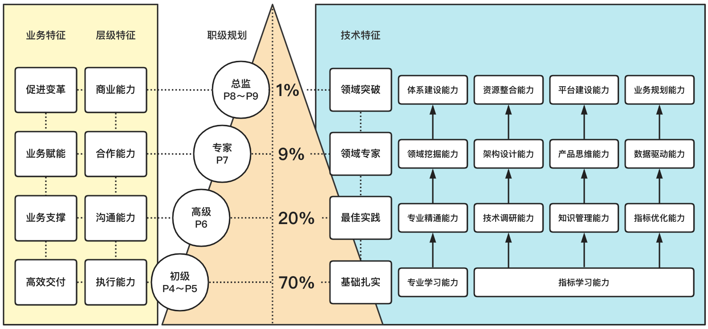

# Front-End Job Model In 2022

## 应用场景

* 团队建设
* 薪酬体系
* 招聘标准
* 晋升参考
## 职级特征

| 岗位 | 特征（技术 + 业务） | 级别（行业对标参考） | 影响范围           |
| ---- | ------------------- | -------------------- | ------------------ |
| 初级 | 基础牢固，高效交付  | P5                   | 个人               |
| 高级 | 最佳实践，业务支撑  | P6                   | 团队               |
| 专家 | 领域专家，业务赋能  | P7                   | 上下游部门、业务线 |
| 总监 | 行业布局，促进变革  | P8～P9               | 企业、行业         |

## 特征详解

|       职级规划       | 技术特征                                                     | 业务特征                                                     | 层级特征                                                     |
| :------------------: | ------------------------------------------------------------ | ------------------------------------------------------------ | ------------------------------------------------------------ |
|   **初级** P5   | **基础牢固** 1. **专业学习能力**。熟练掌握常用编程**语言**、**框架**、**工具**。 2. **指标学习能力**。对产品的研发**质量**、**性能**、**效率**、**体验**等方面数据指标有基础的概念认知。 | **高效交付** 高效完成开发任务，精确还原**需求**、**交互**、**视觉**。理解**业务背景**，贯彻**研发流程**，保障**交付质量**。 | **执行能力** 把上级的命令和想法变成行动，把行动变成结果，按时完成任务的能力。 |
|   **高级** P6   | **最佳实践** 1. **专业精通能力**。对常用专业技能有系统的学习能力。 2. **技术调研能力**。对技术解决方案的选型具有较广的技术视野，能够分析各种方案的优劣势。 3. **知识管理能力**。能够选择合适的方式维护项目知识体系，不限于**文档**、**注释**、**流程工具**等。 4. **指标优化能力**。通过引入技术和工具，在产品的研发**质量**、**性能**、**效率**、**体验**等方面指标有较强的优化能力。 | **业务支撑** 针对业务规划与项目研发管理，有一定的思考与见解，并能够找到单点功能实现的最优路径。通过抽象与技术沉淀实现关键指标优化，充分体现研发质量。 | **沟通能力** 表达清晰，能够抓住问题的重点。认真倾听，有耐心，有思考。能够体现出换位思考，同理心，及专业性等品质。 |
|   **专家** P7   | **领域专家** 1. **领域挖掘能力**。精通所在细分领域的前端技术体系。 2. **架构设计能力**。根据业务及团队特点，设计领域架构方案，具备先进性、扩展性、复用性。 3. **产品思维能力**。主导技术产品化和服务化。 4. **数据驱动能力**。设计数据指标验证结果，创造可衡量的技术价值。  | **业务赋能** 在具体领域范围内，定义核心问题，有清晰的**价值**、**优先级**、和**可行性**判断；制定完善的执行方案，并系统性解决核心问题，带来可衡量的业务价值。 | **合作能力** 良好的人际关系、清晰的自我认知、积极的工作态度、卓越的工作结果。能够让合作方深刻的感受到合作共赢的价值理念。 |
| **总监** P8～P9 | **行业布局** 1.**体系建设能力**。 对技术体系有全面理解，通过跨领域体系设计和思考，打造前瞻性的技术布局。 2. **资源整合能力**。推动上下游合作链路优化和技术体系升级，助力业务塑造核心价值。 3. **平台建设能力**。主导技术产品规模化和产业化，通过跨领域平台建设，提供有效的价值和服务体系，并建设技术壁垒。 4. **业务规划能力**。通过技术创新促进业务变革。 | **促进变革** 对业务所在行业的发展有清晰的判断，能够通过平台化的技术服务建设，创造业务增量价值，促进业务变革。 | **商业能力** 具备商业常识和一定的理论基础，深刻理解组织、财务、市场和运营等职能的相互关系。能够对商业的发展模式做出准确的判断，以及快速决策的能力。 |

## 概念解读

### 领域

随着科技的不断进步，前端行业技术应用越来越多元化，大量的细分知识体系需要深耕，因此，有效的定义细分领域，对实现技术价值有较强的指导性。

领域特性：

* 领先性：具备可持续的发展空间，而不是在可预见的时间内成为技术债。
* 规模性：具备可规模化的应用能力，能够建立可衡量的技术价值。
* 生态化：具备繁荣的技术生态，能够形成完整的知识体系。

推荐前端领域，以及领域的前沿方向：

* 互动技术：AR & VR，
* 跨端技术：多端同构、全球化
* 智能化：机器学习
* 体验经济：体验度量
* 中后台：研发链路、低代码
* 数据可视化：商业智能
* 工程体系：链路一体化、安全生产
* Node.js:  serverless
* 多媒体

 **## License**

